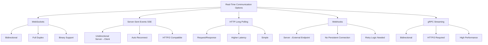
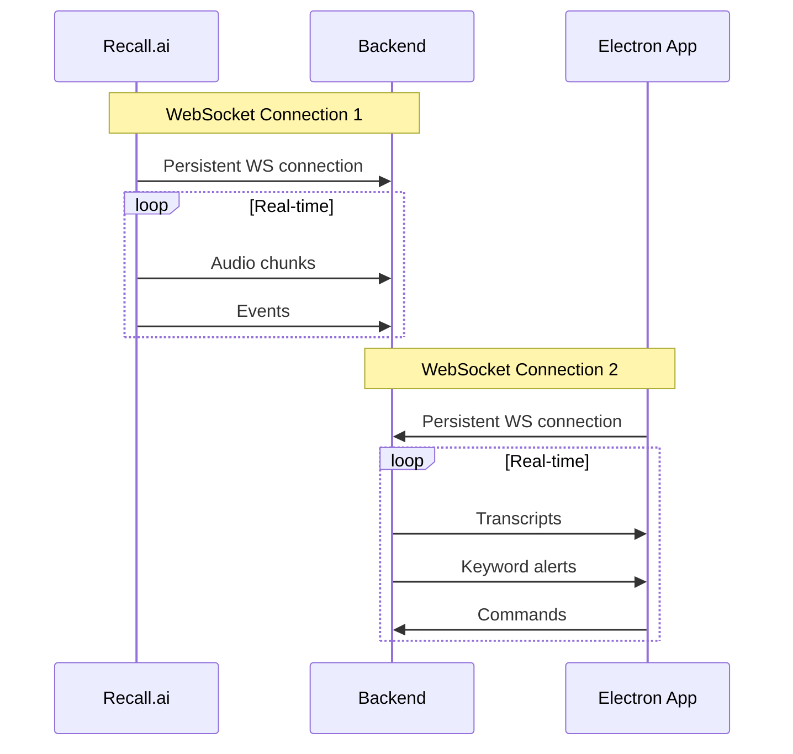
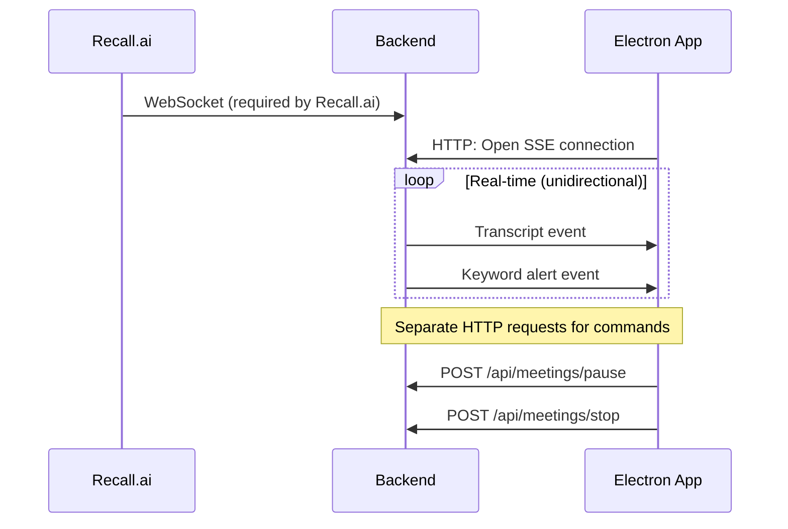
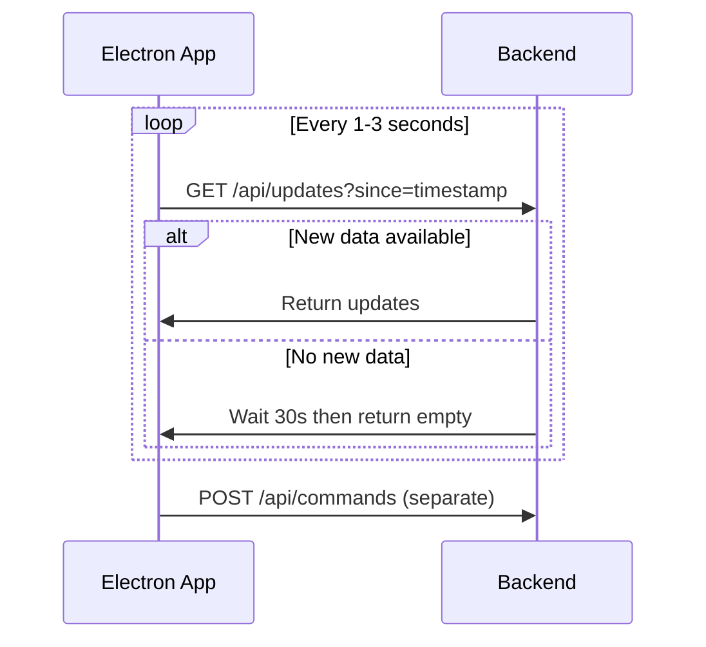
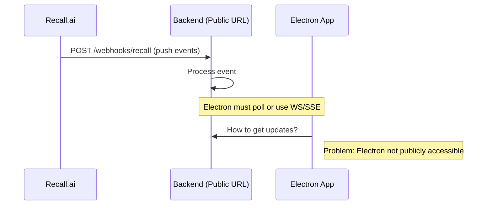
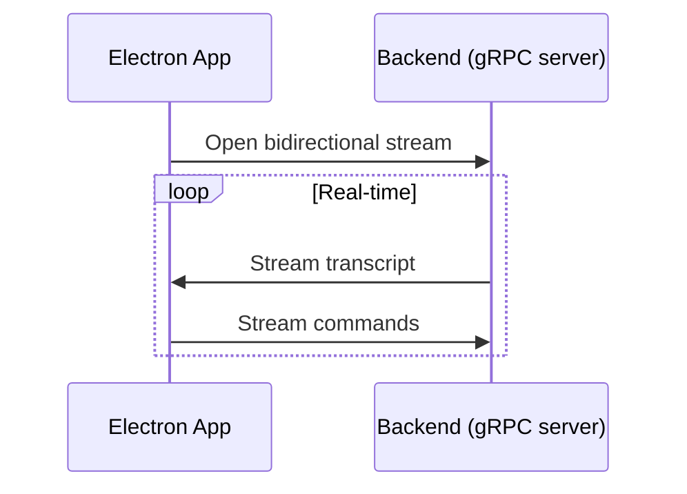
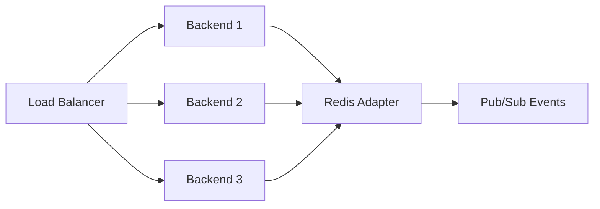
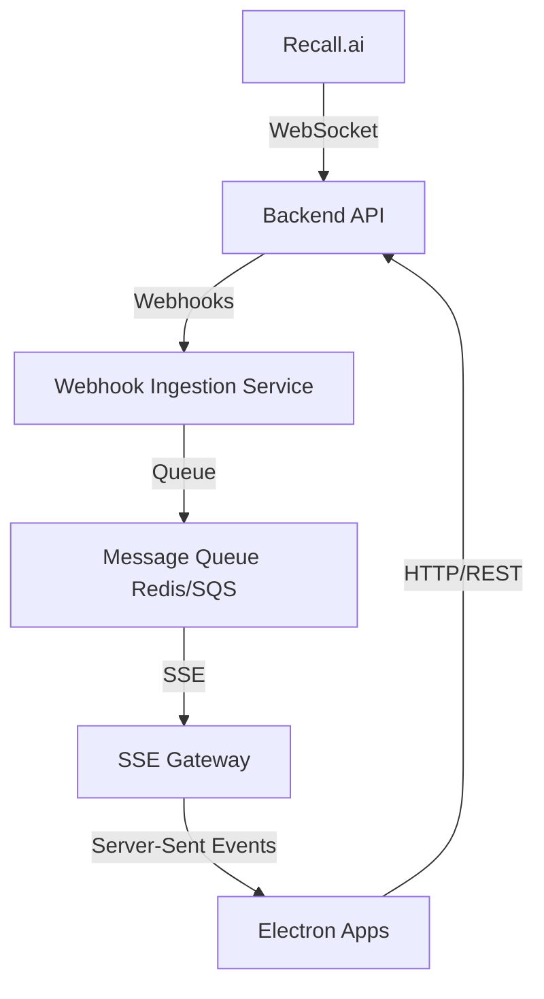

# Architecture Decision Record: Real-Time Communication Method

## Context

Our meeting intelligence app needs real-time communication between:
1. **Recall.ai → Your Backend**: Receiving audio streams and events
2. **Your Backend → Electron App**: Delivering transcripts and keyword alerts
3. **Electron App → Backend**: Sending commands (pause, stop, configure)

## Decision: Communication Methods

### Overview of Options



---

## Option Analysis

### Option 1: WebSockets ⭐ (Current Choice)

#### Architecture


#### Pros ✅
- **Bidirectional**: Client can send commands back to server
- **Low latency**: ~50-200ms typical latency
- **Full duplex**: Send and receive simultaneously
- **Binary support**: Efficient for audio data
- **Industry standard**: Well-understood, mature libraries
- **Recall.ai requires it**: No choice for receiving their streams
- **Single connection**: Reduces overhead vs multiple HTTP requests
- **Real-time feel**: Best UX for live transcription

#### Cons ❌
- **Stateful**: Server must maintain connection state (harder to scale)
- **Connection management**: Need heartbeat/ping-pong to detect disconnects
- **Load balancing complexity**: Need sticky sessions or Redis adapter
- **Resource intensive**: Each connection holds memory
- **Firewall issues**: Some corporate networks block WebSocket
- **No automatic reconnection**: Must implement manually
- **HTTP caching impossible**: Can't leverage CDN/proxy caching

#### When WebSocket is Best
- ✅ Need bidirectional communication
- ✅ Low latency required (< 1 second)
- ✅ High message frequency (many messages per second)
- ✅ Binary data transfer
- ✅ Long-lived connections (meetings are 30min - 2hrs)

#### Cost Implications
- **Concurrent connections**: 1,000 users × 2 connections = 2,000 open sockets
- **Memory**: ~5KB per connection = 10MB for 2,000 connections (manageable)
- **Backend instances**: May need 2-4 instances for load balancing
- **Infrastructure**: Need Redis for pub/sub if multi-instance

---

### Option 2: Server-Sent Events (SSE)

#### Architecture


#### Pros ✅
- **Simpler than WebSocket**: Built on HTTP, easier to implement
- **Auto reconnection**: Browser automatically reconnects
- **HTTP/2 compatible**: Works with modern infrastructure
- **Text-based**: Easy to debug with browser tools
- **Firewall friendly**: Uses standard HTTP port
- **HTTP caching**: Can cache static resources
- **Works through proxies**: Better compatibility

#### Cons ❌
- **Unidirectional only**: Server → Client only
- **Need separate HTTP requests**: For client → server commands
- **Not supported by Recall.ai**: Still need WebSocket for Recall.ai → Backend
- **Text only**: JSON overhead for binary data
- **Browser limit**: Max 6 concurrent connections per domain (not issue for Electron)
- **Higher latency**: Typically 200-500ms vs WebSocket's 50-200ms

#### Verdict
**Could work but hybrid architecture:**
- Recall.ai → Backend: WebSocket (required)
- Backend → Electron: SSE
- Electron → Backend: Regular HTTP/REST

**Trade-off**: Simpler client code, but split architecture and need to handle commands separately.

---

### Option 3: HTTP Long Polling

#### Architecture


#### Pros ✅
- **Simplest implementation**: Just HTTP requests
- **No special infrastructure**: Works anywhere
- **Maximum compatibility**: Works through any firewall/proxy
- **Stateless**: Easy to scale horizontally

#### Cons ❌
- **High latency**: 1-3 second delay minimum
- **Inefficient**: Constant HTTP overhead
- **Not real-time**: Feels sluggish for live transcription
- **Server load**: Many more requests than WebSocket
- **Battery drain**: Constant polling on mobile/laptop
- **Still need WebSocket**: For Recall.ai connection anyway

#### Verdict
**Not recommended**: Too slow for real-time transcription UX. Only viable as fallback.

---

### Option 4: Webhooks (Backend only)

#### Architecture


#### Pros ✅
- **No persistent connection**: Server doesn't hold state
- **Scalable**: Can handle many clients easily
- **Retry built-in**: Most services retry failed webhooks

#### Cons ❌
- **Electron can't receive webhooks**: Not publicly accessible
- **Not real-time**: Delays in webhook delivery
- **Recall.ai doesn't support**: They use WebSocket, not webhooks
- **Still need another method**: To push to Electron app

#### Verdict
**Not applicable**: Doesn't solve the Electron → Backend problem.

---

### Option 5: gRPC Streaming

#### Architecture


#### Pros ✅
- **High performance**: Binary protocol (Protocol Buffers)
- **Bidirectional streaming**: Like WebSocket but better
- **Type safety**: Strong typing with .proto files
- **Code generation**: Auto-generate client/server code
- **HTTP/2 based**: Modern infrastructure
- **Built-in error handling**: Better than WebSocket

#### Cons ❌
- **Recall.ai doesn't support**: Still need WebSocket for them
- **Steeper learning curve**: More complex than WebSocket
- **Limited browser support**: Requires gRPC-web proxy
- **Overkill for MVP**: Too much complexity for early stage
- **Debugging harder**: Binary protocol less readable

#### Verdict
**Future consideration**: Great for scale, but WebSocket simpler for MVP.

---

## Comparison Matrix

| Feature | WebSocket | SSE | Long Polling | Webhooks | gRPC |
|---------|-----------|-----|--------------|----------|------|
| **Bidirectional** | ✅ Yes | ❌ No | ✅ Yes* | ❌ No | ✅ Yes |
| **Real-time (< 500ms)** | ✅ Yes | ⚠️ Maybe | ❌ No | ❌ No | ✅ Yes |
| **Binary support** | ✅ Yes | ❌ No | ❌ No | ✅ Yes | ✅ Yes |
| **Recall.ai compatible** | ✅ Yes | ❌ No | ❌ No | ❌ No | ❌ No |
| **Easy to scale** | ⚠️ Medium | ⚠️ Medium | ✅ Easy | ✅ Easy | ⚠️ Medium |
| **Implementation complexity** | ⚠️ Medium | ✅ Low | ✅ Low | ✅ Low | ❌ High |
| **Firewall friendly** | ⚠️ Maybe | ✅ Yes | ✅ Yes | ✅ Yes | ⚠️ Maybe |
| **Browser support** | ✅ Excellent | ✅ Good | ✅ Excellent | N/A | ⚠️ Needs proxy |
| **Resource efficient** | ✅ Yes | ✅ Yes | ❌ No | ✅ Yes | ✅ Yes |
| **Auto reconnect** | ❌ No | ✅ Yes | ✅ Yes | N/A | ⚠️ Complex |

\* Long polling is technically bidirectional but inefficient

---

## Recommended Approach

### For MVP: **WebSocket** ✅

**Reasoning:**
1. **Recall.ai requires WebSocket** - No choice for Backend ← Recall.ai
2. **Best UX**: Real-time transcription feels instant
3. **Bidirectional**: Can send commands without separate HTTP
4. **Proven**: Libraries like Socket.io abstract complexity
5. **Good enough scale**: Can handle 1,000+ concurrent users

### Implementation Tips

```javascript
// Backend (Node.js + Socket.io)
const io = require('socket.io')(server);

io.on('connection', (socket) => {
  // Authenticate
  if (!authenticate(socket.handshake.auth.token)) {
    socket.disconnect();
    return;
  }
  
  // Join user's room
  socket.join(`user_${socket.userId}`);
  
  // Handle commands
  socket.on('pause_meeting', (meetingId) => {
    // Handle pause
  });
  
  // Heartbeat
  socket.on('ping', () => socket.emit('pong'));
});

// Push updates to user
io.to(`user_${userId}`).emit('transcript_update', data);
```

```javascript
// Electron App
import io from 'socket.io-client';

const socket = io('wss://your-backend.com', {
  auth: { token: userToken },
  reconnection: true,
  reconnectionDelay: 1000,
  reconnectionAttempts: 5
});

socket.on('transcript_update', (data) => {
  // Update UI
});

socket.on('keyword_alert', (data) => {
  // Show notification
});

// Send command
socket.emit('pause_meeting', meetingId);
```

### Scaling WebSockets

**For 100-1,000 users:**
- Single Node.js server with Socket.io
- No special infrastructure needed

**For 1,000-10,000 users:**


- Multiple backend instances
- Redis adapter for Socket.io
- Sticky sessions in load balancer

**For 10,000+ users:**
- Consider dedicated WebSocket service
- Use AWS API Gateway WebSocket
- Or consider gRPC migration

---

## Alternative Hybrid Approach (More Scalable)

If scaling becomes an issue, consider this:



**Benefits:**
- Stateless SSE gateway (easy to scale)
- Backend can scale independently
- Message queue handles spikes
- Electron sends commands via REST (simpler)

**Trade-offs:**
- More complex architecture
- Higher latency (~300-500ms vs 100ms)
- More moving parts

---

## Decision: Start with WebSocket, Plan for Hybrid

### Phase 1 (MVP): Pure WebSocket
- Simple architecture
- Fast to implement
- Good UX
- Scales to 1,000 users

### Phase 2 (Growth): WebSocket + Redis
- Add Redis adapter
- Multiple backend instances
- Load balancing
- Scales to 10,000 users

### Phase 3 (Scale): Consider Hybrid
- Evaluate SSE for Electron ← Backend
- Keep WebSocket for Recall.ai ← Backend
- Add message queue for buffering
- Scales to 100,000+ users

---

## Answered: Is WebSocket the Best Method?

### Short Answer
**Yes, for your MVP and growth phase** (0-10,000 users)

### Long Answer
**WebSocket is the best choice because:**

1. ✅ **Required by Recall.ai** - You have to use it anyway
2. ✅ **Best UX** - Real-time feel for live transcription
3. ✅ **Bidirectional** - Send commands without separate HTTP
4. ✅ **Proven** - Battle-tested with Socket.io
5. ✅ **Good enough scale** - Can handle your needs for 1-2 years

**When to reconsider:**
- ⚠️ When you hit 10,000+ concurrent users
- ⚠️ When WebSocket scaling costs become prohibitive
- ⚠️ When you need multi-region with <100ms latency
- ⚠️ If corporate firewall blocking becomes common complaint

**Better alternatives later:**
- **gRPC** for performance at scale
- **SSE hybrid** for simpler client code
- **AWS API Gateway WebSocket** for managed scaling

---

## Cost Analysis

### WebSocket Costs (1,000 concurrent users)

**Infrastructure:**
- 2x backend servers: $100/month
- Redis instance: $30/month
- Load balancer: $20/month
- **Total: ~$150/month**

**API Costs:**
- Recall.ai: ~$0.10/hour per bot × 1,000 meetings/day × 1hr avg = $100/day = $3,000/month
- AssemblyAI: ~$0.25/hour × same = $250/day = $7,500/month
- **Total: ~$10,500/month**

**Conclusion:** WebSocket infrastructure cost ($150) is **negligible** compared to API costs ($10,500). Optimize API usage, not WebSocket!

### SSE Costs (1,000 concurrent users)

**Infrastructure:**
- 2x backend servers: $100/month (same as WebSocket)
- Load balancer: $20/month
- **Total: ~$120/month**

**Savings:** $30/month (2% reduction) - **Not worth the complexity trade-off**

---

## Final Recommendation

**Use WebSocket with Socket.io**

```bash
# Backend
npm install socket.io redis @socket.io/redis-adapter

# Electron
npm install socket.io-client
```

**Why:**
- Simplest path to working product
- Best UX for real-time transcription
- Scales to your needs (1-2 years runway)
- Industry standard approach
- Easy to find developers familiar with it

**When to revisit this decision:**
- You reach 5,000+ concurrent users
- WebSocket connection costs exceed $500/month
- You need multi-region deployment
- Corporate firewall blocking affects >10% of users

---

**Decision Status**: ✅ Approved  
**Review Date**: After reaching 5,000 concurrent users  
**Owner**: Engineering Team

