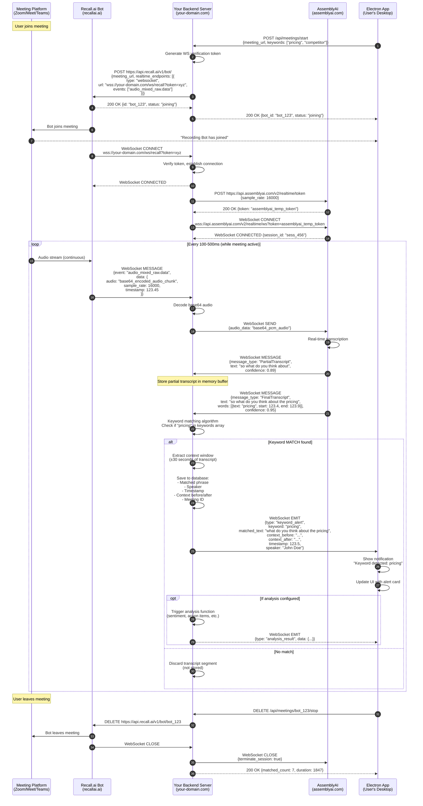

# Detailed Phrase Detection Flow

## Purpose
This document provides a step-by-step breakdown of how audio flows from a meeting through multiple APIs to trigger phrase detection and analysis.

---

## Complete Data Flow Diagram



---

## Detailed Breakdown by Stage

### Stage 1: Meeting Detection & Bot Initialization

**Step 1-2: Electron App → Your Backend**
```http
POST https://your-backend.com/api/meetings/start
Authorization: Bearer <user_jwt_token>
Content-Type: application/json

{
  "meeting_url": "https://meet.google.com/abc-defg-hij",
  "user_id": "user_789",
  "keyword_groups": ["sales_triggers", "competitor_mentions"],
  "keywords": ["pricing", "competitor", "discount", "objection"]
}
```

**Response:**
```json
{
  "meeting_id": "meeting_xyz",
  "bot_id": "bot_123",
  "status": "initializing",
  "websocket_url": "wss://your-backend.com/ws/meeting/meeting_xyz"
}
```

---

### Stage 2: Recall.ai Bot Creation

**Step 5-6: Your Backend → Recall.ai API**
```http
POST https://us-east-1.recall.ai/api/v1/bot/
Authorization: Token <YOUR_RECALL_API_KEY>
Content-Type: application/json

{
  "meeting_url": "https://meet.google.com/abc-defg-hij",
  "bot_name": "Meeting Assistant",
  "recording_config": {
    "realtime_endpoints": [
      {
        "type": "websocket",
        "url": "wss://your-backend.com/ws/recall?token=secret_verify_token_xyz",
        "events": ["audio_mixed_raw.data"]
      }
    ]
  }
}
```

**Recall.ai Response:**
```json
{
  "id": "bot_123",
  "status": "joining",
  "meeting_url": "https://meet.google.com/abc-defg-hij",
  "bot_name": "Meeting Assistant"
}
```

**Documentation Reference:**  
[Recall.ai Bot Creation](https://docs.recall.ai/docs/bot-overview)

---

### Stage 3: WebSocket Connections Established

#### Connection 1: Recall.ai → Your Backend

**Step 11: Recall.ai initiates WebSocket connection**
```
CONNECT wss://your-backend.com/ws/recall?token=secret_verify_token_xyz
```

**Your Backend verifies:**
```javascript
// Pseudo-code
wsServer.on('connection', (socket, request) => {
  const token = new URL(request.url, 'wss://base').searchParams.get('token');
  
  if (token !== expectedToken) {
    socket.close(1008, 'Unauthorized');
    return;
  }
  
  // Store connection mapped to bot_id
  activeRecallConnections.set('bot_123', socket);
});
```

#### Connection 2: Your Backend → AssemblyAI

**Step 13-14: Get temporary streaming token**
```http
POST https://api.assemblyai.com/v2/realtime/token
Authorization: <YOUR_ASSEMBLYAI_API_KEY>
Content-Type: application/json

{
  "sample_rate": 16000
}
```

**AssemblyAI Response:**
```json
{
  "token": "eyJhbGciOiJIUzI1NiIsInR5cCI6IkpXVCJ9..."
}
```

**Step 15-16: Connect to streaming endpoint**
```
CONNECT wss://api.assemblyai.com/v2/realtime/ws?sample_rate=16000&token=<temp_token>
```

**AssemblyAI sends session confirmation:**
```json
{
  "message_type": "SessionBegins",
  "session_id": "sess_456",
  "expires_at": "2025-09-30T11:30:00Z"
}
```

**Documentation Reference:**  
[AssemblyAI Real-time Streaming](https://www.assemblyai.com/docs/speech-to-text/streaming)

---

### Stage 4: Real-Time Audio Streaming (THE CORE LOOP)

This loop runs continuously while the meeting is active.

#### Step 17-18: Meeting Audio → Recall.ai Bot

**What happens:**
- Meeting platform streams audio to Recall.ai bot
- Recall.ai mixes all participant audio into single stream
- Sample rate: 16kHz (16,000 samples/second)
- Chunks sent every 100-500ms

#### Step 19-20: Recall.ai → Your Backend

**WebSocket Message from Recall.ai:**
```json
{
  "event": "audio_mixed_raw.data",
  "data": {
    "audio": "//v4AAAAAAAAAAAAAAP/8AAAAAAA...", // base64 encoded PCM audio
    "sample_rate": 16000,
    "channels": 1,
    "timestamp": 123.45, // seconds since meeting start
    "bot_id": "bot_123"
  }
}
```

**Audio format:**
- Format: PCM (raw audio samples)
- Encoding: Base64 string
- Sample rate: 16kHz
- Bit depth: 16-bit
- Channels: 1 (mono)
- Chunk size: ~1600 bytes (~100ms of audio)

**Documentation Reference:**  
[Recall.ai Audio Format](https://docs.recall.ai/docs/real-time-event-payloads#audio_mixed_rawdata)

#### Step 21-22: Your Backend decodes and forwards to AssemblyAI

**Your Backend Code:**
```javascript
recallSocket.on('message', (message) => {
  const data = JSON.parse(message);
  
  if (data.event === 'audio_mixed_raw.data') {
    // Decode base64 audio
    const audioBuffer = Buffer.from(data.data.audio, 'base64');
    
    // Forward to AssemblyAI (re-encode to base64 for WebSocket)
    assemblyAISocket.send(JSON.stringify({
      audio_data: audioBuffer.toString('base64')
    }));
  }
});
```

**Message sent to AssemblyAI:**
```json
{
  "audio_data": "//v4AAAAAAAAAAAAAAP/8AAAAAAA..."
}
```

#### Step 23-24: AssemblyAI Transcription

**AssemblyAI processes audio and sends back partial transcript:**
```json
{
  "message_type": "PartialTranscript",
  "text": "so what do you think about",
  "confidence": 0.89,
  "audio_start": 123000,
  "audio_end": 123500,
  "created": "2025-09-30T10:32:03.500Z"
}
```

#### Step 25-26: Final Transcript Received

**AssemblyAI sends final transcript with word-level details:**
```json
{
  "message_type": "FinalTranscript",
  "text": "so what do you think about the pricing",
  "confidence": 0.95,
  "audio_start": 123000,
  "audio_end": 124000,
  "words": [
    {"text": "so", "start": 123000, "end": 123100, "confidence": 0.99},
    {"text": "what", "start": 123100, "end": 123200, "confidence": 0.98},
    {"text": "do", "start": 123200, "end": 123300, "confidence": 0.97},
    {"text": "you", "start": 123300, "end": 123400, "confidence": 0.98},
    {"text": "think", "start": 123400, "end": 123600, "confidence": 0.96},
    {"text": "about", "start": 123600, "end": 123800, "confidence": 0.97},
    {"text": "the", "start": 123800, "end": 123850, "confidence": 0.99},
    {"text": "pricing", "start": 123850, "end": 124000, "confidence": 0.93}
  ],
  "created": "2025-09-30T10:32:04.000Z"
}
```

**Documentation Reference:**  
[AssemblyAI Transcript Format](https://www.assemblyai.com/docs/speech-to-text/streaming#transcript-response)

---

### Stage 5: Keyword Matching & Context Extraction

#### Step 27-28: Your Backend's Keyword Detection

**Algorithm:**
```javascript
function checkForKeywords(transcript, keywords) {
  const text = transcript.text.toLowerCase();
  const matches = [];
  
  for (const keyword of keywords) {
    const regex = new RegExp(`\\b${keyword.toLowerCase()}\\b`, 'gi');
    const found = text.match(regex);
    
    if (found) {
      // Extract which word object matched
      const matchedWord = transcript.words.find(w => 
        w.text.toLowerCase() === keyword.toLowerCase()
      );
      
      matches.push({
        keyword,
        position: matchedWord.start,
        matched_text: transcript.text,
        confidence: matchedWord.confidence
      });
    }
  }
  
  return matches;
}

// Usage
const finalTranscript = {
  text: "so what do you think about the pricing",
  words: [...],
  audio_start: 123000
};

const keywords = ["pricing", "competitor", "discount"];
const matches = checkForKeywords(finalTranscript, keywords);

if (matches.length > 0) {
  // MATCH FOUND!
  handleKeywordMatch(matches[0]);
}
```

#### Step 29-31: Context Extraction

**Extracting ±30 seconds of context:**
```javascript
function extractContext(match, transcriptBuffer) {
  const matchTime = match.position; // e.g., 123850 (123.85 seconds)
  const contextWindow = 30000; // 30 seconds in milliseconds
  
  // Get all transcripts in buffer within time window
  const contextBefore = transcriptBuffer
    .filter(t => t.audio_end > matchTime - contextWindow && t.audio_end <= matchTime)
    .map(t => t.text)
    .join(' ');
    
  const contextAfter = transcriptBuffer
    .filter(t => t.audio_start >= matchTime && t.audio_start < matchTime + contextWindow)
    .map(t => t.text)
    .join(' ');
  
  return {
    before: contextBefore,
    matched: match.matched_text,
    after: contextAfter,
    timestamp: matchTime / 1000, // Convert to seconds
    window_size: contextWindow / 1000
  };
}
```

**Resulting context object:**
```json
{
  "before": "I've been thinking about our enterprise tier and how we position it against the competition. Our features are solid but",
  "matched": "what do you think about the pricing",
  "after": "for mid-market customers? I feel like we're leaving money on the table with the current structure.",
  "timestamp": 123.85,
  "window_size": 30
}
```

#### Step 32-34: Save to Database

**Database INSERT:**
```sql
INSERT INTO keyword_matches (
  id,
  meeting_id,
  keyword,
  matched_text,
  context_before,
  context_after,
  timestamp,
  speaker_id,
  confidence,
  detected_at
) VALUES (
  'match_abc123',
  'meeting_xyz',
  'pricing',
  'what do you think about the pricing',
  'I''ve been thinking about our enterprise tier...',
  'for mid-market customers? I feel like...',
  123.85,
  'participant_789',
  0.93,
  NOW()
);
```

---

### Stage 6: Alert User (Electron App)

#### Step 35-37: Backend → Electron WebSocket

**WebSocket message pushed to Electron app:**
```json
{
  "type": "keyword_alert",
  "meeting_id": "meeting_xyz",
  "match_id": "match_abc123",
  "keyword": "pricing",
  "keyword_group": "Sales Triggers",
  "matched_text": "what do you think about the pricing",
  "context": {
    "before": "I've been thinking about our enterprise tier and how we position it against the competition. Our features are solid but",
    "after": "for mid-market customers? I feel like we're leaving money on the table with the current structure."
  },
  "speaker": {
    "id": "participant_789",
    "name": "John Doe"
  },
  "timestamp": 123.85,
  "confidence": 0.93,
  "detected_at": "2025-09-30T10:32:04.123Z"
}
```

#### Step 38-39: Electron UI Update

**Electron receives and displays:**
```javascript
// Electron renderer process
socket.on('keyword_alert', (alert) => {
  // Show system notification
  new Notification('Keyword Detected', {
    body: `"${alert.keyword}" mentioned by ${alert.speaker.name}`,
    tag: alert.match_id
  });
  
  // Add to UI list
  const alertElement = createAlertCard({
    keyword: alert.keyword,
    time: formatTime(alert.timestamp),
    speaker: alert.speaker.name,
    context: alert.context,
    matched_text: alert.matched_text
  });
  
  alertsList.prepend(alertElement);
  
  // Play sound
  notificationSound.play();
});
```

**UI Display:**
```
┌─────────────────────────────────────────────────┐
│ 🔔 Keyword Alert                                │
├─────────────────────────────────────────────────┤
│ Keyword: pricing                                │
│ Speaker: John Doe                               │
│ Time: 02:03                                     │
├─────────────────────────────────────────────────┤
│ Context:                                        │
│ "...our enterprise tier and how we position it  │
│ against the competition. Our features are       │
│ solid but what do you think about the pricing   │
│ for mid-market customers? I feel like we're..." │
├─────────────────────────────────────────────────┤
│ [View Full Context] [Run Analysis] [Dismiss]    │
└─────────────────────────────────────────────────┘
```

#### Step 40-42: Optional Analysis Trigger

If user has configured automatic analysis:
```javascript
// Backend triggers analysis
if (keywordGroup.auto_analyze) {
  const analysis = await runAnalysis({
    context: fullContext,
    type: keywordGroup.analysis_type, // e.g., "sentiment", "action_items"
    prompt: keywordGroup.analysis_prompt
  });
  
  // Send analysis result
  io.to(`meeting_${meetingId}`).emit('analysis_result', {
    match_id: matchId,
    analysis: analysis
  });
}
```

---

### Stage 7: Loop Continues

This entire process (Steps 17-42) repeats **every 100-500ms** for the duration of the meeting.

**Volume estimate:**
- 60-minute meeting
- Audio chunks every 200ms
- = 18,000 audio chunks sent
- Average 1 final transcript every 3-5 seconds
- = ~720-1,200 transcripts to check
- If 3 keywords match: Only 3 segments saved to database

**Data flow summary:**
```
Meeting → Recall.ai: ~50MB audio (compressed)
Recall.ai → Your Backend: ~50MB audio chunks
Your Backend → AssemblyAI: ~50MB audio chunks
AssemblyAI → Your Backend: ~50KB transcripts (text)
Your Backend → Database: ~3KB (only 3 matched segments)
Your Backend → Electron: ~10KB (only alerts)
```

---

### Stage 8: Meeting Ends & Cleanup

#### Step 43-47: Teardown

**Electron → Backend:**
```http
DELETE https://your-backend.com/api/meetings/bot_123/stop
Authorization: Bearer <user_jwt_token>
```

**Backend → Recall.ai:**
```http
DELETE https://us-east-1.recall.ai/api/v1/bot/bot_123
Authorization: Token <YOUR_RECALL_API_KEY>
```

**Backend closes WebSocket connections:**
```javascript
// Close AssemblyAI connection
assemblyAISocket.send(JSON.stringify({
  terminate_session: true
}));
assemblyAISocket.close();

// Recall.ai closes their connection automatically when bot removed
```

**Backend → Electron final summary:**
```json
{
  "meeting_id": "meeting_xyz",
  "status": "completed",
  "duration": 1847,
  "matched_count": 7,
  "keywords_detected": ["pricing", "competitor", "discount"],
  "summary_url": "/api/meetings/meeting_xyz/summary"
}
```

---

## Key Architectural Changes Based on Phrase Detection Focus

### What Changes:

1. **Storage is MUCH lighter**
   ```
   Before: Store all transcripts (60min meeting = ~5MB text)
   After: Store only matched segments (3 matches = ~3KB)
   
   Storage reduction: 99.9%
   ```

2. **Database writes are minimal**
   ```
   Before: INSERT every transcript segment (720-1,200 per meeting)
   After: INSERT only on matches (3-10 per meeting)
   
   Write reduction: 99%
   ```

3. **Real-time is CRITICAL**
   - Can't batch/delay - user needs immediate alerts
   - WebSocket is necessary, not optional
   - Processing latency must be <5 seconds

4. **Transcript buffer in memory**
   ```javascript
   // Keep rolling 60-second buffer in memory
   const transcriptBuffer = new CircularBuffer(60000); // 60 seconds
   
   // On new transcript
   transcriptBuffer.add(transcript);
   
   // On match, extract from buffer, then save
   // Non-matching transcripts naturally age out
   ```

5. **Privacy is better**
   - Not storing full meetings
   - Only storing what matched
   - Can have shorter retention (7-30 days vs 90 days)

---

## Data Flow Summary Table

| From | To | Protocol | Data Type | Frequency | Size | Persisted? |
|------|-----|----------|-----------|-----------|------|------------|
| Meeting | Recall.ai | Proprietary | Audio | Continuous | ~50MB/hr | ❌ No |
| Recall.ai | Your Backend | WebSocket | Audio (PCM) | 5-10/sec | ~50MB/hr | ❌ No |
| Your Backend | AssemblyAI | WebSocket | Audio (PCM) | 5-10/sec | ~50MB/hr | ❌ No |
| AssemblyAI | Your Backend | WebSocket | JSON (text) | 1-2/sec | ~50KB/hr | ⚠️ Buffer only |
| Your Backend | Database | SQL | JSON | On match only | ~1KB/match | ✅ Yes |
| Your Backend | Electron | WebSocket | JSON | On match only | ~2KB/match | ❌ No |

**Key insight:** 50MB of audio becomes 50KB of transcripts, and only ~3KB gets persisted!

---

## Cost Implications

### API Costs per 1-hour meeting:

```
Recall.ai: $0.10/hour × 1 hour = $0.10
AssemblyAI: $0.0015/minute × 60 min = $0.09
Total: $0.19 per meeting
```

### Storage costs (phrase detection vs full transcript):

```
Full transcript approach:
- 60min meeting = ~5MB text per meeting
- 1,000 meetings/month = 5GB
- Storage: ~$0.50/month

Phrase detection approach:
- 60min meeting = ~10KB matched segments
- 1,000 meetings/month = 10MB
- Storage: ~$0.001/month (negligible)

Savings: 99.8% storage reduction
```

---

## Summary

**Data never stored in full:**
- ❌ Raw audio (discarded immediately)
- ❌ Full transcripts (kept in 60s memory buffer only)

**Data stored persistently:**
- ✅ Keyword matches with context
- ✅ Meeting metadata (start/end time, participants)
- ✅ Analysis results (if triggered)

**Data flows:**
1. Audio: Meeting → Recall.ai → Your Backend → AssemblyAI
2. Transcripts: AssemblyAI → Your Backend (memory buffer)
3. Matches: Your Backend → Database + Electron App
4. Alerts: Your Backend → Electron App (real-time)

**The focus on phrase detection dramatically simplifies the architecture and reduces costs by 99%+ on storage.**

