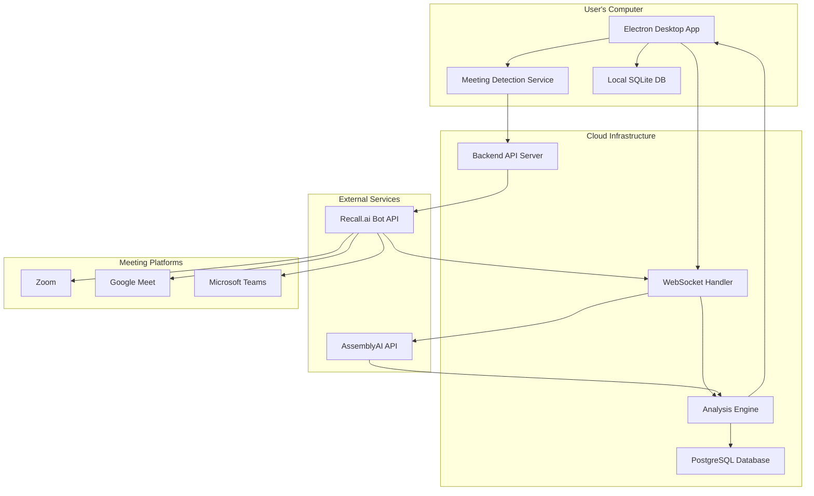
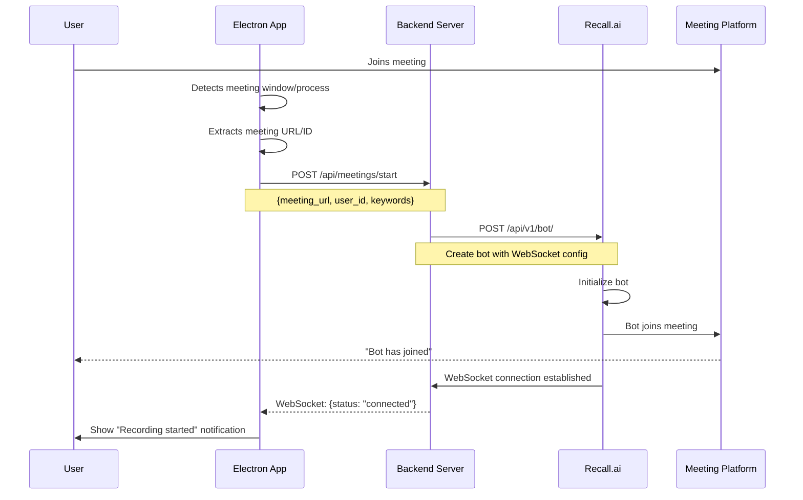
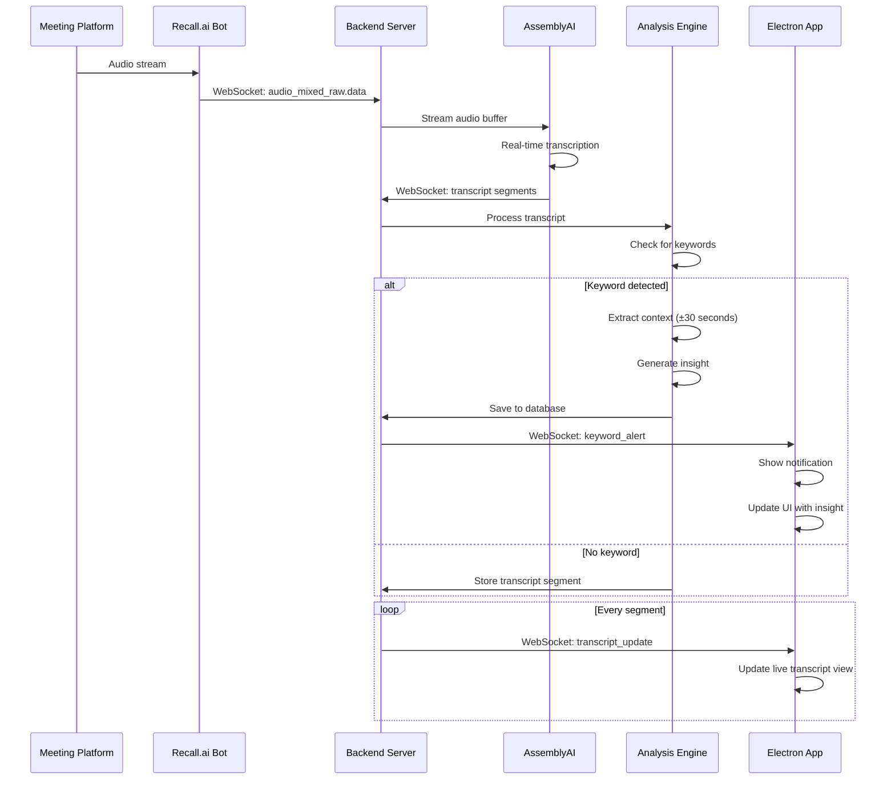
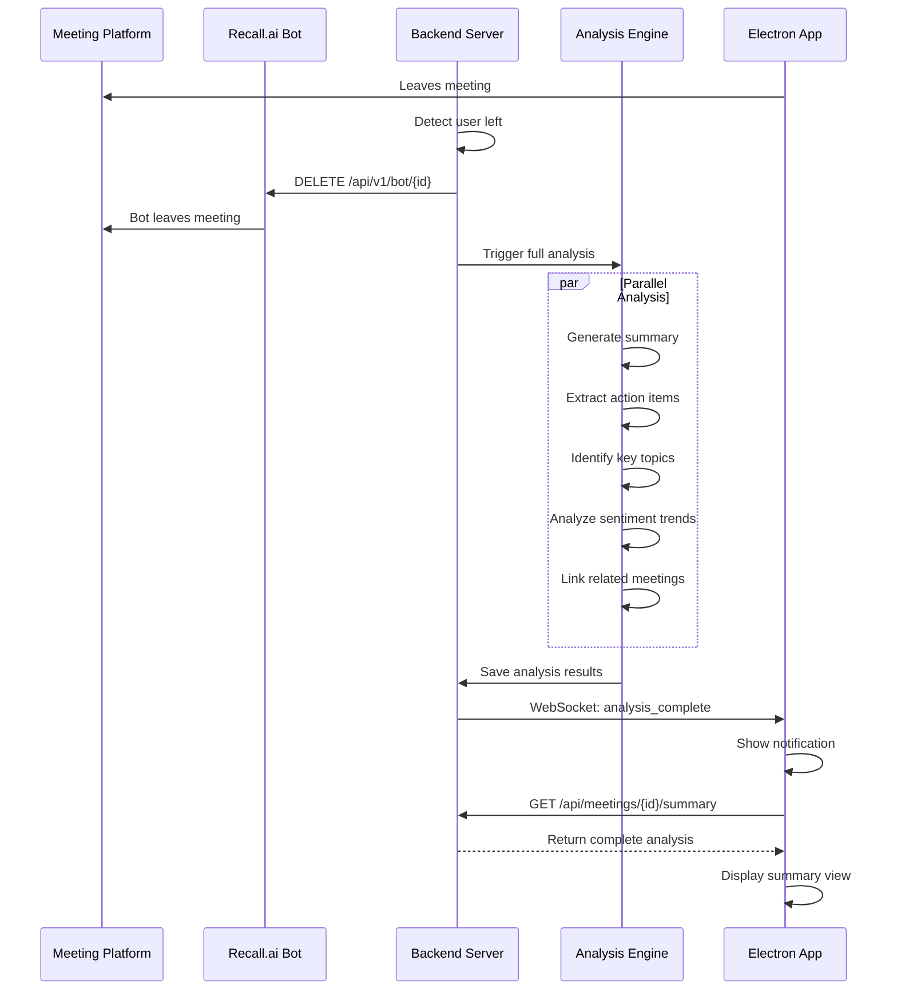
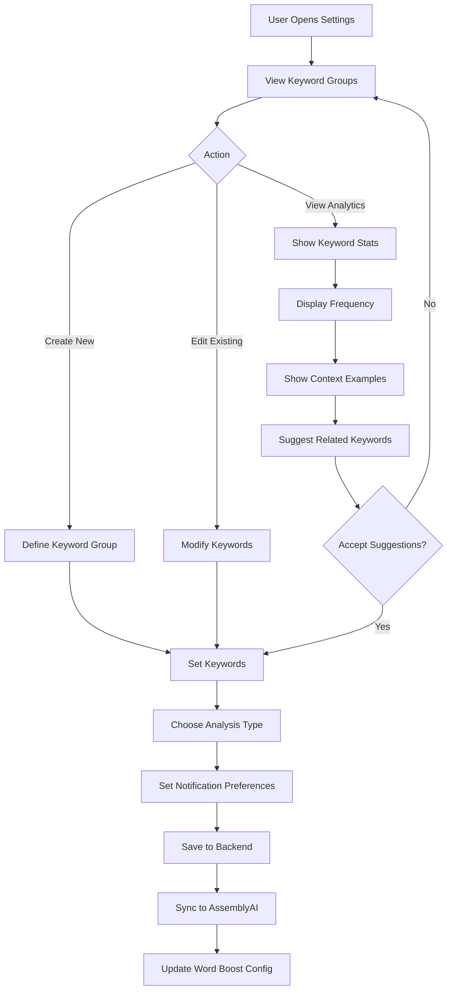
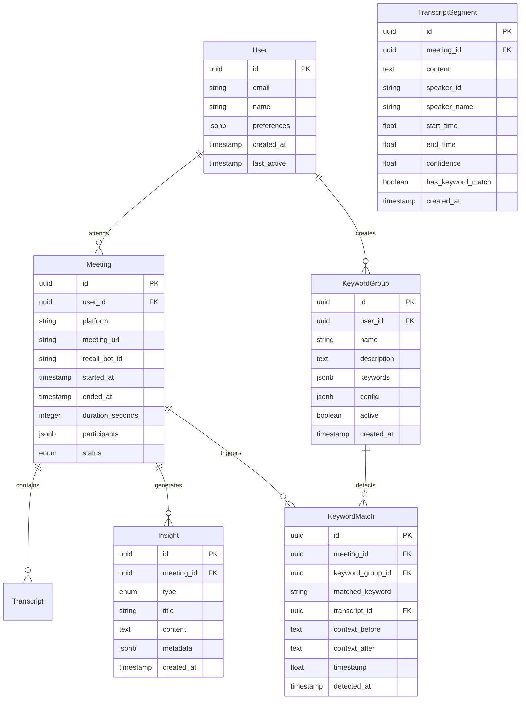
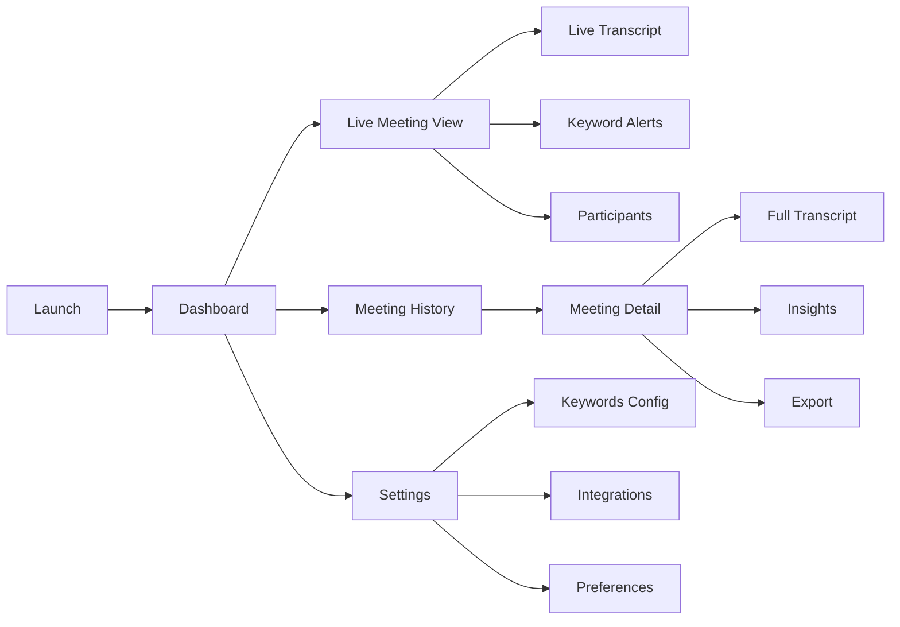

# Product Requirements Document: Meeting Intelligence App

## Executive Summary

A desktop application that automatically detects when users join online meetings and monitors for specific trigger phrases in real-time. When a monitored phrase is detected, the app captures the context and runs targeted analysis on that segment. Unlike traditional transcription tools, this app focuses exclusively on phrase-triggered events rather than comprehensive meeting notes.

**Target Platforms**: macOS, Windows, Linux (via Electron)  
**Core Technology Stack**: Electron, Node.js/Python backend, Recall.ai API, AssemblyAI API

**Key Differentiator**: Event-driven phrase detection, not comprehensive transcription

---

## Problem Statement

### Current Pain Points
1. **Missing critical moments** when specific topics are mentioned in meetings
2. **No real-time alerts** when important phrases or keywords are discussed
3. **Manual monitoring** of meetings for specific topics is attention-draining
4. **Lost context** around when key phrases were mentioned
5. **Reactive rather than proactive** - finding out later that something important was discussed

### Target Users
- **Knowledge workers** attending 3+ meetings per day
- **Team leads** who need to track action items and decisions
- **Sales professionals** monitoring competitor mentions or pricing discussions
- **Product managers** tracking feature requests and user feedback
- **Executives** needing meeting summaries and key takeaways

---

## Goals and Objectives

### Primary Goals
1. **Automatic meeting detection**: Seamlessly detect when user joins Zoom, Google Meet, or Microsoft Teams
2. **Real-time keyword monitoring**: Trigger analysis when specific phrases are mentioned
3. **Intelligent insights**: Provide contextual summaries and action items
4. **Minimal friction**: No manual setup per meeting required

### Success Metrics
- Time to deploy bot: < 5 seconds from meeting join
- Keyword detection accuracy: > 95%
- User engagement: Average 3+ meetings per day per active user
- Retention: 70% 7-day retention, 50% 30-day retention

---

## User Stories

### Core Workflows

**As a user, I want to:**
- Automatically have the app detect when I join a meeting
- Set custom keywords that trigger specific analyses
- Receive real-time notifications when keywords are mentioned
- View a summary of meeting insights after the call
- Search through past meeting transcripts
- Export insights to my note-taking app

**As a sales professional, I want to:**
- Get alerted when competitors are mentioned
- Track pricing discussions automatically
- Capture objections and concerns raised
- Generate follow-up emails based on meeting content

**As a product manager, I want to:**
- Capture all feature requests mentioned
- Track user pain points discussed
- Identify common themes across multiple calls
- Link meeting insights to product roadmap

---

## Technical Architecture

### High-Level System Architecture



### Component Breakdown

#### 1. Electron Desktop App
**Purpose**: User interface and local meeting detection  
**Key Responsibilities**:
- Monitor active windows/processes for meeting platforms
- Display real-time insights and notifications
- Manage user preferences and keyword configurations
- Cache meeting data locally
- Authenticate with backend server

**Tech Stack**:
- Electron 23+
- React/Vue for UI
- SQLite for local storage
- WebSocket client for real-time updates

#### 2. Backend API Server
**Purpose**: Central orchestration and business logic  
**Key Responsibilities**:
- User authentication and authorization
- Bot lifecycle management (create, monitor, terminate)
- WebSocket connection management
- Data persistence and retrieval
- API rate limiting and error handling

**Tech Stack Options**:
- **Option A**: Node.js + Express + Socket.io
- **Option B**: Python + FastAPI + uvicorn (Recommended)
- **Option C**: Go + Gin + gorilla/websocket

**Recommended**: Python/FastAPI for superior AI/ML ecosystem integration

#### 3. Analysis Engine
**Purpose**: Process transcripts and generate insights  
**Key Responsibilities**:
- Real-time keyword detection
- Context extraction around trigger words
- Sentiment analysis
- Action item identification
- Summary generation
- Topic clustering

#### 4. External Integrations

##### Recall.ai Integration
**Documentation**: [https://docs.recall.ai/docs/real-time-websocket-endpoints](https://docs.recall.ai/docs/real-time-websocket-endpoints)

**Features Used**:
- Bot creation and management
- Real-time WebSocket audio streaming
- Participant event tracking
- Basic transcription (fallback)

**API Endpoints**:
- `POST /api/v1/bot/` - Create bot
- `GET /api/v1/bot/{id}` - Get bot status
- `DELETE /api/v1/bot/{id}` - Remove bot from meeting
- WebSocket: `wss://your-server.com/ws/audio` - Receive audio streams

##### AssemblyAI Integration
**Documentation**: [https://www.assemblyai.com/docs](https://www.assemblyai.com/docs)

**Features Used**:
- Real-time transcription streaming
- Word-level timestamps
- Speaker diarization
- Keyword boosting for custom vocabulary
- Sentiment analysis
- Auto highlights
- Topic detection

**API Endpoints**:
- `POST /v2/realtime/token` - Get streaming token
- WebSocket: `wss://api.assemblyai.com/v2/realtime/ws` - Streaming transcription

---

## Detailed Data Flows

### Flow 1: Meeting Detection and Bot Deployment



### Flow 2: Real-Time Transcription and Keyword Detection



### Flow 3: Post-Meeting Analysis



### Flow 4: Keyword Configuration and Learning



---

## Feature Requirements

### Phase 1: MVP (Minimum Viable Product)

#### 1.1 Meeting Detection
**Priority**: P0 (Must Have)

**Requirements**:
- [ ] Detect active Zoom meetings (window title detection)
- [ ] Detect active Google Meet tabs (Chrome extension or window monitoring)
- [ ] Detect active Microsoft Teams meetings
- [ ] Extract meeting URL/ID automatically
- [ ] Manual meeting URL input as fallback

**Acceptance Criteria**:
- Detection latency < 10 seconds from meeting join
- 95% accuracy in URL extraction
- No false positives on other applications

#### 1.2 Bot Deployment
**Priority**: P0 (Must Have)

**Requirements**:
- [ ] Create Recall.ai bot via API
- [ ] Configure real-time WebSocket endpoint
- [ ] Handle bot join failures gracefully
- [ ] Display bot status in UI
- [ ] Remove bot when user leaves

**Acceptance Criteria**:
- Bot joins meeting within 15 seconds
- Clear error messages for failures
- Automatic retry on temporary failures
- Bot leaves within 5 seconds of user exit

#### 1.3 Real-Time Transcription
**Priority**: P0 (Must Have)

**Requirements**:
- [ ] Stream audio from Recall.ai to AssemblyAI
- [ ] Display live transcript in app
- [ ] Show speaker labels
- [ ] Show timestamps
- [ ] Handle connection interruptions

**Acceptance Criteria**:
- Transcription accuracy > 90%
- Latency < 3 seconds from speech to display
- Graceful degradation on connection issues
- Speaker identification accuracy > 80%

#### 1.4 Keyword Detection
**Priority**: P0 (Must Have)

**Requirements**:
- [ ] User can define keyword groups
- [ ] Real-time detection of keywords in transcript
- [ ] Extract ±30 seconds of context around keyword
- [ ] Show in-app notification on detection
- [ ] Log all keyword matches with timestamps

**Acceptance Criteria**:
- Detection latency < 5 seconds from utterance
- Support 50+ keywords per user
- Case-insensitive matching
- Support phrase matching (multi-word)
- No missed detections on clear audio

#### 1.5 Basic Insights
**Priority**: P0 (Must Have)

**Requirements**:
- [ ] Generate post-meeting summary (3-5 bullet points)
- [ ] List all keyword matches with context
- [ ] Show meeting duration and participant count
- [ ] Export summary as text/markdown

**Acceptance Criteria**:
- Summary generated within 30 seconds of meeting end
- Summary captures main topics discussed
- All keyword matches included
- Export maintains formatting

### Phase 2: Enhanced Features

#### 2.1 Advanced Analysis
**Priority**: P1 (Should Have)

**Requirements**:
- [ ] Action item extraction with assignees
- [ ] Sentiment analysis per speaker
- [ ] Topic clustering across meetings
- [ ] Question detection and tracking
- [ ] Decision logging

#### 2.2 Integrations
**Priority**: P1 (Should Have)

**Requirements**:
- [ ] Export to Notion
- [ ] Export to Google Docs
- [ ] Slack notifications
- [ ] Email summaries
- [ ] Calendar integration (auto-detect meetings)

#### 2.3 Search and Discovery
**Priority**: P1 (Should Have)

**Requirements**:
- [ ] Full-text search across all meetings
- [ ] Filter by date, participant, keyword
- [ ] Semantic search (find similar discussions)
- [ ] Timeline view of keyword mentions

#### 2.4 Collaboration
**Priority**: P2 (Nice to Have)

**Requirements**:
- [ ] Share meeting insights with team
- [ ] Comment on specific transcript sections
- [ ] Team keyword templates
- [ ] Analytics dashboard for managers

### Phase 3: Intelligence and Automation

#### 3.1 AI-Powered Features
**Priority**: P2 (Nice to Have)

**Requirements**:
- [ ] Automatic keyword suggestion based on usage
- [ ] Meeting type classification
- [ ] Competitor intelligence dashboard
- [ ] Trend analysis across time
- [ ] Predictive insights

#### 3.2 Workflow Automation
**Priority**: P2 (Nice to Have)

**Requirements**:
- [ ] Zapier integration
- [ ] Custom webhooks on keyword triggers
- [ ] Automatic task creation in project management tools
- [ ] CRM integration (Salesforce, HubSpot)

---

## Data Models

### Database Schema



---

## Security and Privacy

### Security Requirements

1. **Data Encryption**
   - Encrypt all data at rest (AES-256)
   - Use TLS 1.3 for all network communication
   - Encrypt sensitive fields in database (API keys, tokens)

2. **Authentication**
   - OAuth 2.0 for user authentication
   - JWT tokens with 1-hour expiration
   - Refresh token rotation
   - Device fingerprinting

3. **Authorization**
   - Role-based access control (RBAC)
   - Users can only access their own meetings
   - Team features require explicit permissions

4. **API Security**
   - Rate limiting (100 requests/minute per user)
   - API key rotation every 90 days
   - Webhook signature verification
   - CORS policy enforcement

### Privacy Requirements

1. **Data Retention**
   - **Only matched segments stored** (not full transcripts)
   - Matched segments stored for 90 days by default
   - User-configurable retention period (7-365 days)
   - Automatic deletion after retention period
   - Export option before deletion
   - Non-matching transcript segments discarded immediately

2. **User Control**
   - Explicit opt-in for each meeting
   - One-click data deletion
   - Export all data (GDPR compliance)
   - Pause recording at any time

3. **Compliance**
   - GDPR compliant
   - CCPA compliant
   - SOC 2 Type II (future)
   - Meeting participant consent notices

4. **Third-Party Data**
   - Recall.ai: Data retention policy per their terms
   - AssemblyAI: Audio not stored, only transcripts
   - Clear documentation of data flow to users

---

## Technical Specifications

### Performance Requirements

| Metric | Target | Critical Threshold |
|--------|--------|-------------------|
| Meeting detection latency | < 10s | < 30s |
| Bot join time | < 15s | < 45s |
| Transcription latency | < 3s | < 10s |
| Keyword detection latency | < 5s | < 15s |
| Summary generation time | < 30s | < 2min |
| App startup time | < 2s | < 5s |
| Memory usage (Electron) | < 300MB | < 500MB |
| API response time (p95) | < 200ms | < 1s |

### Scalability Requirements

**MVP Phase**:
- Support 100 concurrent users
- 20 concurrent meetings
- 100GB total transcript storage

**Growth Phase** (6 months):
- Support 1,000 concurrent users
- 200 concurrent meetings
- 1TB total transcript storage

**Scale Phase** (12 months):
- Support 10,000 concurrent users
- 2,000 concurrent meetings
- 10TB total transcript storage

### Infrastructure

**Backend Deployment**:
- Platform: AWS/GCP/Railway
- Container orchestration: Docker + Kubernetes
- Load balancing: Application Load Balancer
- Auto-scaling: Based on CPU and connection count

**Database**:
- Primary: PostgreSQL 15+ with pgvector extension
- Cache: Redis for session management
- Search: Elasticsearch for full-text search (Phase 2)

**Monitoring**:
- Application: Datadog/New Relic
- Error tracking: Sentry
- Logging: CloudWatch/GCP Logs
- Uptime: Pingdom

---

## API Specifications

### Backend API Endpoints

#### Authentication
```
POST   /api/auth/register
POST   /api/auth/login
POST   /api/auth/refresh
POST   /api/auth/logout
```

#### Meetings
```
GET    /api/meetings
POST   /api/meetings/start
GET    /api/meetings/{id}
DELETE /api/meetings/{id}
PATCH  /api/meetings/{id}/pause
GET    /api/meetings/{id}/transcript
GET    /api/meetings/{id}/summary
GET    /api/meetings/{id}/insights
POST   /api/meetings/{id}/export
```

#### Keywords
```
GET    /api/keyword-groups
POST   /api/keyword-groups
GET    /api/keyword-groups/{id}
PATCH  /api/keyword-groups/{id}
DELETE /api/keyword-groups/{id}
GET    /api/keyword-groups/{id}/matches
```

#### User Settings
```
GET    /api/user/profile
PATCH  /api/user/profile
GET    /api/user/preferences
PATCH  /api/user/preferences
GET    /api/user/stats
```

### WebSocket Events

#### Client → Server
```javascript
// Subscribe to meeting updates
{
  "type": "subscribe_meeting",
  "meeting_id": "uuid"
}

// Unsubscribe
{
  "type": "unsubscribe_meeting",
  "meeting_id": "uuid"
}
```

#### Server → Client
```javascript
// Bot status update
{
  "type": "bot_status",
  "meeting_id": "uuid",
  "status": "joining|connected|leaving|disconnected",
  "timestamp": "2025-09-30T10:30:00Z"
}

// Transcript update
{
  "type": "transcript_update",
  "meeting_id": "uuid",
  "transcript": {
    "id": "uuid",
    "speaker": "John Doe",
    "text": "Let's discuss the pricing strategy",
    "start_time": 120.5,
    "end_time": 123.2,
    "confidence": 0.95
  }
}

// Keyword alert
{
  "type": "keyword_alert",
  "meeting_id": "uuid",
  "keyword": "pricing",
  "group_name": "Sales Keywords",
  "context": {
    "before": "We should probably...",
    "matched": "discuss the pricing strategy",
    "after": "for the enterprise tier"
  },
  "timestamp": 123.2
}

// Insight generated
{
  "type": "insight_generated",
  "meeting_id": "uuid",
  "insight": {
    "type": "action_item",
    "title": "Follow up on pricing",
    "content": "Team needs to prepare enterprise pricing proposal",
    "timestamp": 125.0
  }
}

// Meeting ended
{
  "type": "meeting_ended",
  "meeting_id": "uuid",
  "summary_ready": true,
  "duration": 1847,
  "participant_count": 4
}
```

---

## UI/UX Specifications

### Main Application Views



### Key UI Components

1. **Dashboard**
   - Today's meeting schedule
   - Recent keyword matches
   - Quick stats (meetings this week, keywords detected)
   - Quick actions (manual meeting join)

2. **Live Meeting View**
   - Real-time transcript with auto-scroll
   - Keyword highlights in different colors
   - Speaker labels with avatars
   - Recording indicator
   - Pause/Resume button
   - End meeting button

3. **Meeting History**
   - List view with search and filters
   - Cards showing: title, date, duration, keyword count
   - Quick preview on hover
   - Bulk actions (export, delete)

4. **Meeting Detail**
   - Summary at top
   - Full transcript with timestamps
   - Keyword matches panel (sticky)
   - Insights tabs (Action Items, Topics, Sentiment)
   - Share and export options

5. **Settings**
   - Keyword groups management
   - Meeting detection preferences
   - Notification preferences
   - Integration setup
   - Account management

---

## Development Roadmap

### Phase 1: MVP (Months 1-3)

**Month 1: Foundation**
- Week 1-2: Backend infrastructure setup
  - API server scaffolding
  - Database schema implementation
  - Authentication system
  - Recall.ai integration
- Week 3-4: Electron app foundation
  - Basic UI framework
  - Meeting detection system
  - WebSocket client

**Month 2: Core Features**
- Week 1-2: Transcription pipeline
  - AssemblyAI integration
  - Real-time transcript display
  - Audio streaming from Recall.ai
- Week 3-4: Keyword system
  - Keyword configuration UI
  - Detection engine
  - Alert notifications

**Month 3: Polish & Launch**
- Week 1-2: Insights generation
  - Summary algorithm
  - Context extraction
  - Export functionality
- Week 3: Beta testing
  - Bug fixes
  - Performance optimization
- Week 4: MVP launch
  - Documentation
  - Deployment
  - User onboarding

### Phase 2: Growth (Months 4-6)

**Month 4: Enhanced Analysis**
- Action item extraction
- Sentiment analysis
- Topic detection
- Search functionality

**Month 5: Integrations**
- Notion export
- Slack notifications
- Google Docs export
- Calendar sync

**Month 6: Team Features**
- Shared keyword templates
- Team analytics
- Collaboration features

### Phase 3: Scale (Months 7-12)

**Month 7-8: AI Features**
- Automatic keyword suggestions
- Meeting classification
- Trend analysis

**Month 9-10: Enterprise**
- SSO integration
- Advanced permissions
- Compliance features
- SLA guarantees

**Month 11-12: Platform**
- API for third-party developers
- Zapier integration
- Webhook system
- Mobile companion app

---

## Dependencies and Risks

### External Dependencies

| Service | Purpose | Risk | Mitigation |
|---------|---------|------|------------|
| **Recall.ai** | Meeting bot and audio capture | Service outage, API changes | Implement retry logic, fallback to screen recording, maintain direct relationship |
| **AssemblyAI** | Transcription and NLP | Service outage, cost scaling | Consider Deepgram as backup, implement local caching, negotiate volume pricing |
| **Meeting Platforms** | Zoom, Meet, Teams | Platform changes, bot blocking | Monitor platform updates, implement multiple detection methods, user communication |
| **AWS/Cloud Provider** | Infrastructure hosting | Service outage | Multi-region deployment, automated failover, local caching |

### Technical Risks

1. **Meeting Detection Reliability**
   - Risk: Platform UI changes break detection
   - Mitigation: Multiple detection methods, regular testing, manual fallback

2. **Transcription Accuracy**
   - Risk: Poor audio quality affects accuracy
   - Mitigation: Audio quality detection, user feedback loop, multiple transcription providers

3. **Real-time Performance**
   - Risk: Latency issues affect user experience
   - Mitigation: CDN for asset delivery, WebSocket optimization, local processing where possible

4. **Scalability**
   - Risk: Concurrent meeting limits
   - Mitigation: Horizontal scaling, connection pooling, queuing system

### Business Risks

1. **Privacy Concerns**
   - Risk: Users hesitant to record meetings
   - Mitigation: Clear privacy policy, user controls, compliance certifications

2. **Meeting Platform Policies**
   - Risk: Platforms may block bot access
   - Mitigation: Comply with ToS, transparent bot presence, explore official APIs

3. **Market Competition**
   - Risk: Otter.ai, Fireflies.ai, and others
   - Mitigation: Focus on keyword-driven insights, faster performance, better UX

4. **Cost Structure**
   - Risk: API costs scale faster than revenue
   - Mitigation: Tiered pricing, usage limits, cost monitoring, negotiate volume discounts

---

## Success Criteria

### Launch Criteria (MVP)
- [ ] 20 beta users actively using for 2+ weeks
- [ ] < 5% crash rate
- [ ] 90%+ transcription accuracy
- [ ] All P0 features implemented
- [ ] Security audit passed
- [ ] Documentation complete

### 3-Month Post-Launch
- 200+ active users
- 50%+ 7-day retention
- 80%+ user satisfaction (NPS > 40)
- < 100ms p95 API latency
- 99.5% uptime

### 6-Month Goals
- 1,000+ active users
- 40%+ 30-day retention
- $5k+ MRR (assuming $10/user/month)
- 3+ major integrations live
- 90%+ transcription accuracy

### 12-Month Vision
- 10,000+ active users
- 35%+ 90-day retention
- $80k+ MRR
- Enterprise customers
- Series A fundraising ready

---

## Appendix

### Glossary

- **Meeting Detection**: Automated identification of when user joins an online meeting
- **Bot**: Recall.ai's virtual participant that joins meetings to capture audio/video
- **Keyword Group**: User-defined collection of related keywords that trigger specific analyses
- **Context Window**: The text before and after a keyword match (typically ±30 seconds)
- **Insight**: AI-generated summary, action item, or analysis based on meeting content
- **Real-time Endpoint**: WebSocket connection for streaming data from Recall.ai
- **Speaker Diarization**: Process of identifying who spoke when in a conversation

### References

1. **Recall.ai Documentation**
   - [Real-Time Websocket Endpoints](https://docs.recall.ai/docs/real-time-websocket-endpoints)
   - [Bot Overview](https://docs.recall.ai/docs/bot-overview)
   - [Real-Time Event Payloads](https://docs.recall.ai/docs/real-time-event-payloads)

2. **AssemblyAI Documentation**
   - [Real-Time Streaming STT](https://www.assemblyai.com/docs/getting-started/transcribe-streaming-audio-from-a-microphone)
   - [Keyword Boosting](https://www.assemblyai.com/docs/concepts/word_boost)
   - [Speaker Diarization](https://www.assemblyai.com/docs/concepts/speaker_diarization)

3. **Electron Best Practices**
   - [Security Guidelines](https://www.electronjs.org/docs/latest/tutorial/security)
   - [Performance](https://www.electronjs.org/docs/latest/tutoria